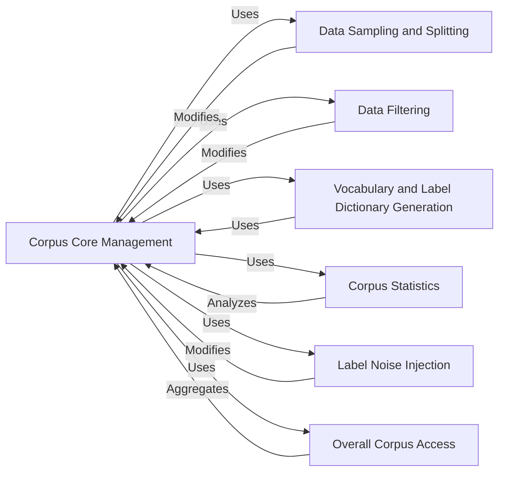

## Component Details

The `flair.data.Corpus` subsystem is a foundational component within the Flair framework, designed to efficiently manage and process datasets for various Natural Language Processing (NLP) tasks. Its core purpose is to encapsulate the training, development, and testing data splits, providing a unified interface for data manipulation, preparation, and analysis.

### Corpus Core Management

This is the central `Corpus` class itself, responsible for initializing, storing, and providing access to the train, development, and test dataset splits. It serves as the primary entry point for all data-related operations within the Flair framework.

**Related Classes/Methods**:

- <a href="https://github.com/flairNLP/flair/blob/master/flair/data.py#L2352-L2419" target="_blank" rel="noopener noreferrer">`flair.data.Corpus.__init__` (2352:2419)</a>

- <a href="https://github.com/flairNLP/flair/blob/master/flair/data.py#L2422-L2424" target="_blank" rel="noopener noreferrer">`flair.data.Corpus.train` (2422:2424)</a>

- <a href="https://github.com/flairNLP/flair/blob/master/flair/data.py#L2427-L2429" target="_blank" rel="noopener noreferrer">`flair.data.Corpus.dev` (2427:2429)</a>

- <a href="https://github.com/flairNLP/flair/blob/master/flair/data.py#L2432-L2434" target="_blank" rel="noopener noreferrer">`flair.data.Corpus.test` (2432:2434)</a>

### Data Sampling and Splitting

This component handles the dynamic adjustment of dataset splits. It can sample missing development or test sets from the training data during corpus initialization and provides methods for downsampling existing splits to a specified percentage. This ensures a complete dataset for training and facilitates experimentation with smaller subsets.

**Related Classes/Methods**:

- <a href="https://github.com/flairNLP/flair/blob/master/flair/data.py#L2352-L2419" target="_blank" rel="noopener noreferrer">`flair.data.Corpus.__init__` (2352:2419)</a>

- <a href="https://github.com/flairNLP/flair/blob/master/flair/data.py#L2445-L2478" target="_blank" rel="noopener noreferrer">`flair.data.Corpus.downsample` (2445:2478)</a>

- <a href="https://github.com/flairNLP/flair/blob/master/flair/data.py#L2590-L2594" target="_blank" rel="noopener noreferrer">`flair.data.Corpus._downsample_to_proportion` (2590:2594)</a>

### Data Filtering

Focuses on data quality by providing utilities to clean the corpus. It can remove sentences that are empty (contain no tokens) or sentences that exceed a specified maximum character length. This helps in maintaining data integrity and preventing issues during model training.

**Related Classes/Methods**:

- <a href="https://github.com/flairNLP/flair/blob/master/flair/data.py#L2480-L2492" target="_blank" rel="noopener noreferrer">`flair.data.Corpus.filter_empty_sentences` (2480:2492)</a>

- <a href="https://github.com/flairNLP/flair/blob/master/flair/data.py#L2494-L2509" target="_blank" rel="noopener noreferrer">`flair.data.Corpus.filter_long_sentences` (2494:2509)</a>

- <a href="https://github.com/flairNLP/flair/blob/master/flair/data.py#L2530-L2544" target="_blank" rel="noopener noreferrer">`flair.data.Corpus._filter_empty_sentences` (2530:2544)</a>

- <a href="https://github.com/flairNLP/flair/blob/master/flair/data.py#L2512-L2527" target="_blank" rel="noopener noreferrer">`flair.data.Corpus._filter_long_sentences` (2512:2527)</a>

### Vocabulary and Label Dictionary Generation

This component is crucial for converting textual data and its associated labels into numerical representations that machine learning models can process. It generates `Dictionary` objects that map unique tokens (vocabulary) or unique label values to integer IDs, considering frequency thresholds.

**Related Classes/Methods**:

- <a href="https://github.com/flairNLP/flair/blob/master/flair/data.py#L2546-L2569" target="_blank" rel="noopener noreferrer">`flair.data.Corpus.make_vocab_dictionary` (2546:2569)</a>

- <a href="https://github.com/flairNLP/flair/blob/master/flair/data.py#L2687-L2793" target="_blank" rel="noopener noreferrer">`flair.data.Corpus.make_label_dictionary` (2687:2793)</a>

- <a href="https://github.com/flairNLP/flair/blob/master/flair/data.py#L2571-L2580" target="_blank" rel="noopener noreferrer">`flair.data.Corpus._get_most_common_tokens` (2571:2580)</a>

- <a href="https://github.com/flairNLP/flair/blob/master/flair/data.py#L2582-L2587" target="_blank" rel="noopener noreferrer">`flair.data.Corpus._get_all_tokens` (2582:2587)</a>

### Corpus Statistics

Provides analytical capabilities to obtain detailed statistics about the corpus. This includes information on the total number of documents, the distribution of documents per class, token counts per tag, and sentence length statistics. These statistics are vital for understanding the dataset's characteristics and for debugging.

**Related Classes/Methods**:

- <a href="https://github.com/flairNLP/flair/blob/master/flair/data.py#L2596-L2618" target="_blank" rel="noopener noreferrer">`flair.data.Corpus.obtain_statistics` (2596:2618)</a>

- <a href="https://github.com/flairNLP/flair/blob/master/flair/data.py#L2621-L2644" target="_blank" rel="noopener noreferrer">`flair.data.Corpus._obtain_statistics_for` (2621:2644)</a>

- <a href="https://github.com/flairNLP/flair/blob/master/flair/data.py#L2647-L2649" target="_blank" rel="noopener noreferrer">`flair.data.Corpus._get_tokens_per_sentence` (2647:2649)</a>

- <a href="https://github.com/flairNLP/flair/blob/master/flair/data.py#L2652-L2658" target="_blank" rel="noopener noreferrer">`flair.data.Corpus._count_sentence_labels` (2652:2658)</a>

- <a href="https://github.com/flairNLP/flair/blob/master/flair/data.py#L2661-L2677" target="_blank" rel="noopener noreferrer">`flair.data.Corpus._count_token_labels` (2661:2677)</a>

### Label Noise Injection

Offers a specialized utility to artificially introduce noise into the labels of a specified dataset split. This is particularly useful for research purposes, such as evaluating the robustness of models to noisy training data or simulating real-world data imperfections.

**Related Classes/Methods**:

- <a href="https://github.com/flairNLP/flair/blob/master/flair/data.py#L2795-L2889" target="_blank" rel="noopener noreferrer">`flair.data.Corpus.add_label_noise` (2795:2889)</a>

### Overall Corpus Access

Provides a convenient way to access all sentences across all three splits (train, dev, and test) as a single concatenated dataset. This is useful for operations that need to iterate over the entire corpus without distinguishing between individual splits.

**Related Classes/Methods**:

- <a href="https://github.com/flairNLP/flair/blob/master/flair/data.py#L2905-L2918" target="_blank" rel="noopener noreferrer">`flair.data.Corpus.get_all_sentences` (2905:2918)</a>

### [FAQ](https://github.com/CodeBoarding/GeneratedOnBoardings/tree/main?tab=readme-ov-file#faq)