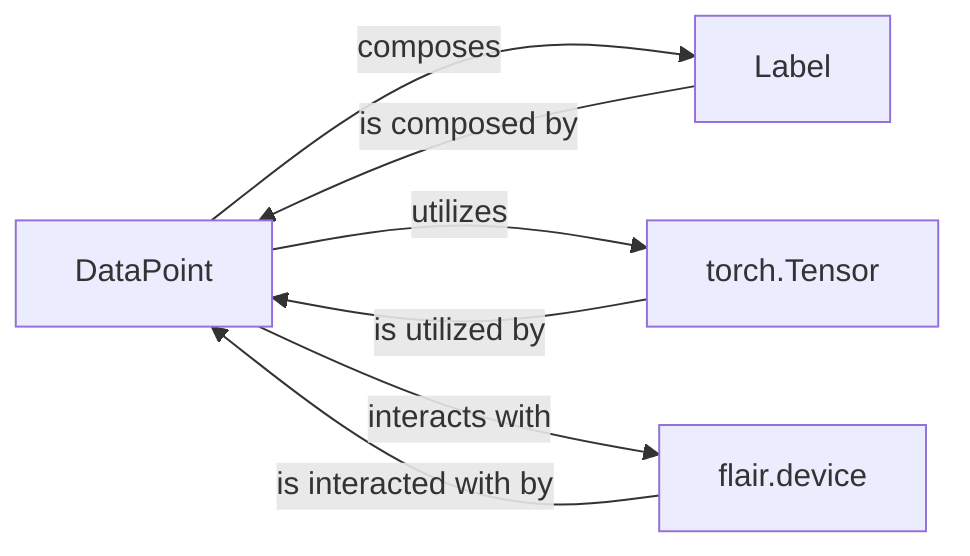

## Component Details

Analysis of the `flair.data.DataPoint` subsystem focusing on its fundamental, direct interactions within the Flair framework.

### DataPoint

The foundational abstract base class for all data units in Flair (e.g., `Token`, `Sentence`). It defines the common interface for storing embeddings, managing various annotation layers, and providing basic textual and positional information, ensuring a consistent way to attach numerical representations and symbolic labels.

**Related Classes/Methods**:

- <a href="https://github.com/flairNLP/flair/blob/master/flair/data.py#L413-L706" target="_blank" rel="noopener noreferrer">`flair.data.DataPoint` (413:706)</a>

### Label

Represents a single annotation or label associated with a `DataPoint`. It encapsulates the label's string value, a confidence score, and any additional metadata. It is a core building block for the annotation system within Flair, directly instantiated and managed by `DataPoint`.

**Related Classes/Methods**:

- <a href="https://github.com/flairNLP/flair/blob/master/flair/data.py#L310-L410" target="_blank" rel="noopener noreferrer">`flair.data.Label` (310:410)</a>

### torch.Tensor

A multi-dimensional matrix containing elements of a single data type, provided by the PyTorch library. In the context of `DataPoint`, `torch.Tensor` is the fundamental data structure used to store numerical embeddings, which are the vectorized representations of the data point.

**Related Classes/Methods**:

- `torch.Tensor` (1:1)

### flair.device

A global object or mechanism within Flair that manages the computational device (CPU or GPU) on which tensors and models operate. It ensures that operations are performed on the correct hardware for efficiency and proper execution within the PyTorch ecosystem.

**Related Classes/Methods**:

- `flair.device` (1:1)

### [FAQ](https://github.com/CodeBoarding/GeneratedOnBoardings/tree/main?tab=readme-ov-file#faq)