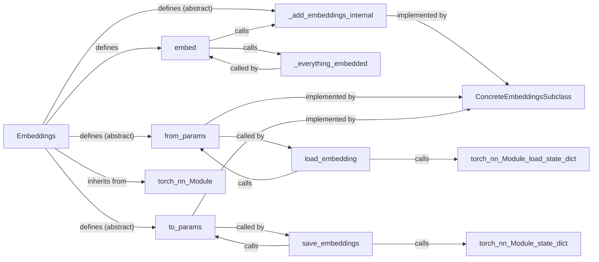

## Component Details

This subsystem revolves around the `Embeddings` abstract base class, which serves as the foundational blueprint for all embedding models within the Flair framework. It establishes a consistent interface for embedding data points and provides mechanisms for model persistence.

### Embeddings

The abstract base class for all embedding modules in Flair. It defines the `embed` method, which takes `DataPoint` objects (typically `Sentence` or `Token`) and populates them with dense vector representations, handling whether embeddings are static or need recomputation. It also provides abstract methods for concrete implementations to define their specific embedding logic and serialization/deserialization.

**Related Classes/Methods**:

- <a href="https://github.com/flairNLP/flair/blob/master/flair/embeddings/base.py#L15-L104" target="_blank" rel="noopener noreferrer">`flair.embeddings.base.Embeddings` (15:104)</a>

### embed

The primary public method of the `Embeddings` class. It takes a single `DataPoint` or a list of `DataPoint` objects and orchestrates the process of populating them with embeddings. It intelligently checks for existing embeddings to prevent redundant computations and delegates the actual embedding logic to `_add_embeddings_internal`.

**Related Classes/Methods**:

- <a href="https://github.com/flairNLP/flair/blob/master/flair/embeddings/base.py#L40-L52" target="_blank" rel="noopener noreferrer">`flair.embeddings.base.Embeddings:embed` (40:52)</a>

### _add_embeddings_internal

This is an abstract private method that *must* be implemented by any concrete subclass of `Embeddings`. It encapsulates the specific logic for computing and adding the particular type of embeddings to the provided data points. This design enforces that each embedding type defines its own unique embedding mechanism.

**Related Classes/Methods**:

- <a href="https://github.com/flairNLP/flair/blob/master/flair/embeddings/base.py#L58-L59" target="_blank" rel="noopener noreferrer">`flair.embeddings.base.Embeddings:_add_embeddings_internal` (58:59)</a>

### _everything_embedded

A private helper method within the `Embeddings` class. Its responsibility is to efficiently check if all data points in a given sequence already have embeddings associated with them under the current embedding's name. This check is crucial for optimizing performance by preventing redundant and computationally expensive embedding computations.

**Related Classes/Methods**:

- <a href="https://github.com/flairNLP/flair/blob/master/flair/embeddings/base.py#L54-L55" target="_blank" rel="noopener noreferrer">`flair.embeddings.base.Embeddings:_everything_embedded` (54:55)</a>

### from_params

An abstract class method responsible for reconstructing an `Embeddings` object from a dictionary of parameters. This method is crucial for deserialization, enabling pre-trained embedding models to be loaded from saved configurations. Concrete embedding classes must provide their own implementation for parameter-based instantiation.

**Related Classes/Methods**:

- <a href="https://github.com/flairNLP/flair/blob/master/flair/embeddings/base.py#L84-L85" target="_blank" rel="noopener noreferrer">`flair.embeddings.base.Embeddings:from_params` (84:85)</a>

### to_params

An abstract method that serializes the embedding object's parameters into a dictionary. This is essential for saving the model's configuration and state, enabling persistence and later reconstruction. Concrete embedding classes must implement this method to define how their parameters are represented.

**Related Classes/Methods**:

- <a href="https://github.com/flairNLP/flair/blob/master/flair/embeddings/base.py#L87-L88" target="_blank" rel="noopener noreferrer">`flair.embeddings.base.Embeddings:to_params` (87:88)</a>

### load_embedding

A class method that facilitates loading an embedding model. It takes a dictionary of parameters, potentially including a `state_dict`, and uses `from_params` to create an instance, then loads the state if provided. This method streamlines the process of loading pre-trained models.

**Related Classes/Methods**:

- <a href="https://github.com/flairNLP/flair/blob/master/flair/embeddings/base.py#L91-L97" target="_blank" rel="noopener noreferrer">`flair.embeddings.base.Embeddings:load_embedding` (91:97)</a>

### save_embeddings

This method is responsible for saving the embedding model's parameters and optionally its `state_dict`. It utilizes `to_params` to retrieve the model's configuration and includes the `state_dict` if specified. This method is vital for persisting trained or pre-trained embedding models.

**Related Classes/Methods**:

- <a href="https://github.com/flairNLP/flair/blob/master/flair/embeddings/base.py#L99-L104" target="_blank" rel="noopener noreferrer">`flair.embeddings.base.Embeddings:save_embeddings` (99:104)</a>

### [FAQ](https://github.com/CodeBoarding/GeneratedOnBoardings/tree/main?tab=readme-ov-file#faq)