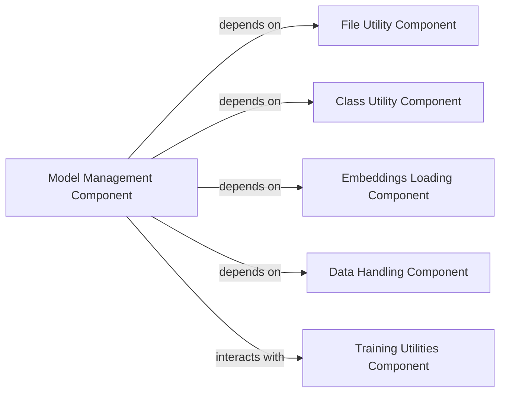

## Component Details

The `flair.nn.model.Model` serves as the abstract foundation for all neural network models within the Flair framework, specifically those designed for downstream NLP tasks. It establishes a unified interface and core functionalities for model lifecycle management, including training, evaluation, and persistence. Its design promotes modularity and extensibility, allowing various concrete NLP models to inherit and implement specific task logic while adhering to a common structure.

### Model Management Component

This is the central abstract component, embodied by `flair.nn.model.Model`. It defines the contract for all Flair neural network models, requiring implementations for `forward_loss` (training) and `evaluate` (performance assessment). It also manages model persistence (saving/loading of parameters, optimizer/scheduler states, and tokenizer information) and provides a mechanism for dynamic model discovery and loading.

**Related Classes/Methods**:

- <a href="https://github.com/flairNLP/flair/blob/master/flair/nn/model.py#L30-L448" target="_blank" rel="noopener noreferrer">`flair.nn.model.Model` (30:448)</a>

- <a href="https://github.com/flairNLP/flair/blob/master/flair/nn/model.py#L81-L86" target="_blank" rel="noopener noreferrer">`flair.nn.model.Model:forward_loss` (81:86)</a>

- <a href="https://github.com/flairNLP/flair/blob/master/flair/nn/model.py#L89-L123" target="_blank" rel="noopener noreferrer">`flair.nn.model.Model:evaluate` (89:123)</a>

- <a href="https://github.com/flairNLP/flair/blob/master/flair/nn/model.py#L275-L289" target="_blank" rel="noopener noreferrer">`flair.nn.model.Model:save` (275:289)</a>

- <a href="https://github.com/flairNLP/flair/blob/master/flair/nn/model.py#L310-L399" target="_blank" rel="noopener noreferrer">`flair.nn.model.Model:load` (310:399)</a>

- <a href="https://github.com/flairNLP/flair/blob/master/flair/nn/model.py#L193-L256" target="_blank" rel="noopener noreferrer">`flair.nn.model.Model:_init_model_with_state_dict` (193:256)</a>

### File Utility Component

This component provides essential utilities for file system interactions, particularly for loading and saving PyTorch model states (`.pt` files) and other data assets. It abstracts low-level file I/O, ensuring robust and consistent data persistence. The `Model` component directly utilizes `load_torch_state` for deserializing model files.

**Related Classes/Methods**:

- <a href="https://github.com/flairNLP/flair/blob/master/flair/file_utils.py#L377-L384" target="_blank" rel="noopener noreferrer">`flair.file_utils.load_torch_state` (377:384)</a>

- `torch.save` (0:0)

### Class Utility Component

This component offers utilities for dynamic class discovery and manipulation, specifically `get_non_abstract_subclasses`. This capability is vital for the `Model.load()` method, allowing it to dynamically identify and instantiate the correct concrete model class from a saved state, even when the exact class is not explicitly known at compile time.

**Related Classes/Methods**:

- <a href="https://github.com/flairNLP/flair/blob/master/flair/class_utils.py#L13-L18" target="_blank" rel="noopener noreferrer">`flair.class_utils.get_non_abstract_subclasses` (13:18)</a>

### Embeddings Loading Component

This component is responsible for managing the loading, initialization, and preparation of various types of pre-trained embeddings (e.g., word, document, transformer embeddings). The `Model`'s internal initialization (`_init_model_with_state_dict`) calls `load_embeddings` to integrate these foundational linguistic representations, which are critical input features for most NLP models.

**Related Classes/Methods**:

- <a href="https://github.com/flairNLP/flair/blob/master/flair/embeddings/base.py#L225-L228" target="_blank" rel="noopener noreferrer">`flair.embeddings.base.load_embeddings` (225:228)</a>

### Data Handling Component

This component provides core data structures (`Sentence`, `Token`) and utilities for representing and manipulating textual data. The `Model`'s `forward_loss` and `evaluate` methods operate on these data structures, and the `Model` also manages an optional `Tokenizer` instance from this component for text preprocessing.

**Related Classes/Methods**:

- <a href="https://github.com/flairNLP/flair/blob/master/flair/data.py#L1177-L2141" target="_blank" rel="noopener noreferrer">`flair.data.Sentence` (1177:2141)</a>

- <a href="https://github.com/flairNLP/flair/blob/master/flair/data.py#L814-L953" target="_blank" rel="noopener noreferrer">`flair.data.Token` (814:953)</a>

- <a href="https://github.com/flairNLP/flair/blob/master/flair/tokenization.py#L12-L63" target="_blank" rel="noopener noreferrer">`flair.tokenization.Tokenizer` (12:63)</a>

### Training Utilities Component

This component encapsulates common utilities and helper functions used across the training process. While `Model` itself doesn't directly implement the full training loop, it stores `optimizer_state_dict` and `scheduler_state_dict`, which are managed and utilized by higher-level training utilities (e.g., `flair.trainers.ModelTrainer`) from this component.

**Related Classes/Methods**:

- <a href="https://github.com/flairNLP/flair/blob/master/flair/training_utils.py#L0-L0" target="_blank" rel="noopener noreferrer">`flair.training_utils` (0:0)</a>

- `flair.trainers.ModelTrainer` (0:0)

### [FAQ](https://github.com/CodeBoarding/GeneratedOnBoardings/tree/main?tab=readme-ov-file#faq)