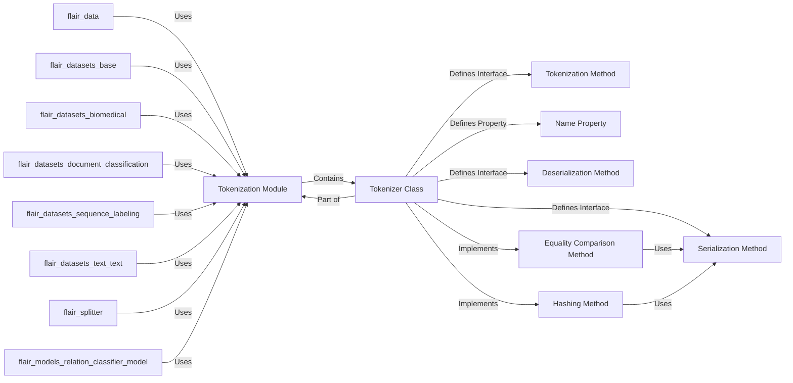

## Component Details

This overview details the core components of the `flair.tokenization.Tokenizer` subsystem, focusing on their structure, purpose, and interactions. The selected components are fundamental as they define the abstract contract for text tokenization within the Flair library, enabling extensibility and consistent handling of tokenizer instances.

### Tokenization Module

The top-level package (`flair.tokenization`) that encapsulates all text tokenization functionalities. It serves as the organizational container for the abstract `Tokenizer` class and its concrete implementations.

**Related Classes/Methods**:

- <a href="https://github.com/flairNLP/flair/blob/master/flair/tokenization.py#L1-L64" target="_blank" rel="noopener noreferrer">`flair.tokenization` (1:64)</a>

### Tokenizer Class

An abstract base class (`ABC`) that defines the standard interface for all tokenizer implementations. It mandates the `tokenize`, `to_dict`, and `from_dict` methods, and provides default implementations for `__eq__` and `__hash__` for consistent object comparison and hashing.

**Related Classes/Methods**:

- <a href="https://github.com/flairNLP/flair/blob/master/flair/tokenization.py#L12-L63" target="_blank" rel="noopener noreferrer">`flair.tokenization.Tokenizer` (12:63)</a>

### Tokenization Method

An abstract method within the `Tokenizer` class that concrete subclasses must implement. Its core purpose is to convert a raw text string into a list of string tokens.

**Related Classes/Methods**:

- <a href="https://github.com/flairNLP/flair/blob/master/flair/tokenization.py#L23-L24" target="_blank" rel="noopener noreferrer">`flair.tokenization.Tokenizer:tokenize` (23:24)</a>

### Name Property

A property of the `Tokenizer` class that provides a unique, human-readable identifier for a tokenizer's configuration. By default, it returns the class name but can be overridden for more specific naming.

**Related Classes/Methods**:

- <a href="https://github.com/flairNLP/flair/blob/master/flair/tokenization.py#L27-L28" target="_blank" rel="noopener noreferrer">`flair.tokenization.Tokenizer:name` (27:28)</a>

### Serialization Method

An abstract method that serializes the tokenizer's configuration and state into a dictionary. This method is crucial for defining the unique identity of a tokenizer instance, as its output is used for equality checks and hashing.

**Related Classes/Methods**:

- <a href="https://github.com/flairNLP/flair/blob/master/flair/tokenization.py#L31-L37" target="_blank" rel="noopener noreferrer">`flair.tokenization.Tokenizer:to_dict` (31:37)</a>

### Deserialization Method

A class method that acts as a factory, reconstructing a `Tokenizer` object from a configuration dictionary. It complements the `to_dict` method, enabling the recreation of tokenizer instances from their serialized state.

**Related Classes/Methods**:

- <a href="https://github.com/flairNLP/flair/blob/master/flair/tokenization.py#L41-L43" target="_blank" rel="noopener noreferrer">`flair.tokenization.Tokenizer:from_dict` (41:43)</a>

### Equality Comparison Method

Defines how two `Tokenizer` objects are compared for equality. It relies on the `to_dict()` method to compare the serialized states, ensuring that equality is based on configuration rather than object identity.

**Related Classes/Methods**:

- <a href="https://github.com/flairNLP/flair/blob/master/flair/tokenization.py#L45-L50" target="_blank" rel="noopener noreferrer">`flair.tokenization.Tokenizer:__eq__` (45:50)</a>

### Hashing Method

Provides a hash value for `Tokenizer` objects, allowing them to be used in hash-based data structures. It computes the hash based on the sorted representation of the dictionary returned by `to_dict()`, ensuring consistent hashing for identical configurations.

**Related Classes/Methods**:

- <a href="https://github.com/flairNLP/flair/blob/master/flair/tokenization.py#L52-L63" target="_blank" rel="noopener noreferrer">`flair.tokenization.Tokenizer:__hash__` (52:63)</a>

### [FAQ](https://github.com/CodeBoarding/GeneratedOnBoardings/tree/main?tab=readme-ov-file#faq)