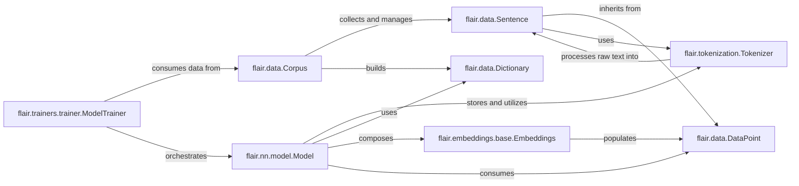

## Component Details

The architecture of `flair` is designed around a clear separation of concerns, with core components handling data representation, preprocessing, embedding, model definition, and training orchestration. Together, these components form a cohesive and modular architecture that allows Flair to efficiently handle various NLP tasks, from data loading and preprocessing to model training and prediction.

### flair.data.DataPoint

The foundational abstract base class for all data units in Flair (e.g., `Token`, `Sentence`). It defines the common interface for storing embeddings, managing various annotation layers, and providing basic textual and positional information, ensuring a consistent way to attach numerical representations and symbolic labels.

**Related Classes/Methods**:

- <a href="https://github.com/flairNLP/flair/blob/master/flair/data.py#L413-L706" target="_blank" rel="noopener noreferrer">`flair.data.DataPoint` (413:706)</a>

### flair.data.Sentence

A concrete implementation of `DataPoint` representing a sequence of tokens, typically a single sentence. It manages the raw text, a list of `Token` objects, and can hold various linguistic annotations (sentence-level labels, spans). It handles lazy tokenization, ensuring tokens are generated only when needed.

**Related Classes/Methods**:

- <a href="https://github.com/flairNLP/flair/blob/master/flair/data.py#L1177-L2141" target="_blank" rel="noopener noreferrer">`flair.data.Sentence` (1177:2141)</a>

### flair.data.Corpus

The central container for managing datasets, typically split into training, development (dev), and testing sets. It provides methods for sampling, filtering, and generating `Dictionary` objects from the data, and ensures all necessary splits are available for a training run.

**Related Classes/Methods**:

- <a href="https://github.com/flairNLP/flair/blob/master/flair/data.py#L2333-L2930" target="_blank" rel="noopener noreferrer">`flair.data.Corpus` (2333:2930)</a>

### flair.tokenization.Tokenizer

An abstract base class that defines the contract for tokenizing raw text. Subclasses implement specific tokenization algorithms, providing the `tokenize` method to split a string into a list of string tokens. It's essential for preparing raw text for further processing.

**Related Classes/Methods**:

- <a href="https://github.com/flairNLP/flair/blob/master/flair/tokenization.py#L12-L63" target="_blank" rel="noopener noreferrer">`flair.tokenization.Tokenizer` (12:63)</a>

### flair.data.Dictionary

A utility class responsible for creating and managing a mapping between unique string items (like words, characters, or labels) and their corresponding integer IDs. This is crucial for converting symbolic data into numerical representations required by neural networks.

**Related Classes/Methods**:

- <a href="https://github.com/flairNLP/flair/blob/master/flair/data.py#L70-L307" target="_blank" rel="noopener noreferrer">`flair.data.Dictionary` (70:307)</a>

### flair.embeddings.base.Embeddings

The abstract base class for all embedding modules in Flair. It defines the `embed` method, which takes `DataPoint` objects (typically `Sentence` or `Token`) and populates them with dense vector representations, handling whether embeddings are static or need recomputation.

**Related Classes/Methods**:

- <a href="https://github.com/flairNLP/flair/blob/master/flair/embeddings/base.py#L15-L104" target="_blank" rel="noopener noreferrer">`flair.embeddings.base.Embeddings` (15:104)</a>

### flair.nn.model.Model

The abstract base class for all neural network models in Flair that perform downstream NLP tasks (e.g., `SequenceTagger`, `TextClassifier`). It defines core functionalities required for training and inference, including `label_type`, `forward_loss` (for computing loss), and `evaluate` (for performance assessment). It also manages model saving/loading.

**Related Classes/Methods**:

- <a href="https://github.com/flairNLP/flair/blob/master/flair/nn/model.py#L30-L448" target="_blank" rel="noopener noreferrer">`flair.nn.model.Model` (30:448)</a>

### flair.trainers.trainer.ModelTrainer

The central orchestration component responsible for managing the entire training and evaluation lifecycle of a Flair model. It takes a `flair.nn.Model` and a `flair.data.Corpus`, handles the training loop (epochs, mini-batches), manages the optimizer and learning rate scheduler, and performs evaluations on development and test sets.

**Related Classes/Methods**:

- <a href="https://github.com/flairNLP/flair/blob/master/flair/trainers/trainer.py#L43-L1035" target="_blank" rel="noopener noreferrer">`flair.trainers.trainer.ModelTrainer` (43:1035)</a>

### [FAQ](https://github.com/CodeBoarding/GeneratedOnBoardings/tree/main?tab=readme-ov-file#faq)